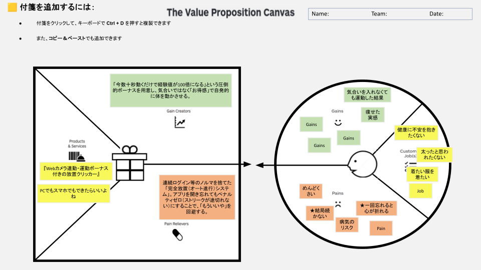

## The Value Proposition Canvas

### Customer Profile（顧客像）
- **Customer Jobs (顧客が解決したい課題・叶えたいこと)**
  - 健康に不安を抱きたくない
  - 太ったと思われたくない
  - 着たい服を着たい
- **Gains (顧客が得たい恩恵)**
  - 気合いを入れなくても運動した結果
  - 痩せた実感
- **Pains (顧客が抱える悩み・苦痛)**
  - めんどくさい
  - ★結局続かない
  - 病気のリスク
  - ★一回忘れると心が折れる

### Value Map（価値提供）
- **Products & Services (製品・サービス)**
  - 『Webカメラ連動・運動ボーナス付きの放置クリッカー』
  - PCでもスマホでもできたらいいよね
- **Gain Creators (恩恵をどう生み出すか)**
  - 「今数十秒動くだけで経験値が100倍になる」という圧倒的ボーナスを用意し、気合いではなく「お得感」で自発的に体を動かさせる。
- **Pain Relievers (悩みをどう取り除くか)**
  - 連続ログイン等のノルマを捨てた「完全放置（オート進行）システム」。アプリを開き忘れてもペナルティゼロ（ストリークが途切れない）にすることで、「もういいや」を回避する。
